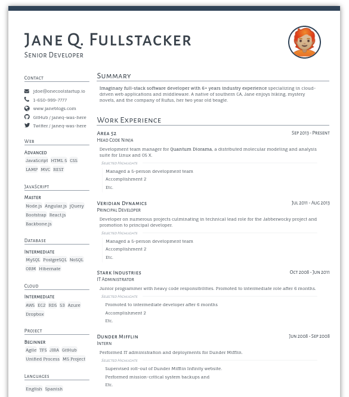

# Ulmer Macchiato Theme! ☕️+🥛

This is a forked and heavily modified version of Macchiato-ibic JSONResume theme.

## Usage

The easieasy way is to use [HackMyResume](https://github.com/hacksalot/HackMyResume)
1. Download [HackMyResume](https://github.com/hacksalot/HackMyResume)
  ```
  npm install hackmyresume
  ```

2. Download the theme
  ```
  git clone https://github.com/ulmerkott/jsonresume-theme-macchiato-ulmer.git
  ```

3. Use [HackMyResume](https://github.com/hacksalot/HackMyResume) to build your resume
  ```
  hackmyresume build jane-resume.json to jane-resume.html -t jsonresume-theme-macchiato-ulmer
  ```

## Example



### PDF output

While [HackMyResume](https://github.com/hacksalot/HackMyResume) can generate PDFs I don't recommend it when using this theme since the output is not very good.
Instead, use a web browser to export the final PDF.

## License

Available under the [MIT license](http://mths.be/mit).

